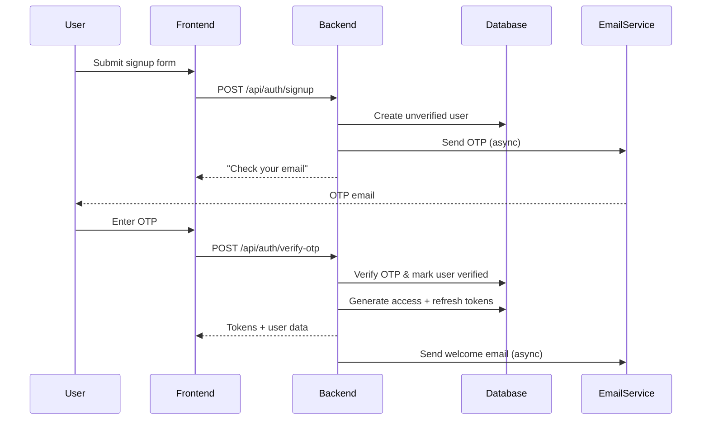
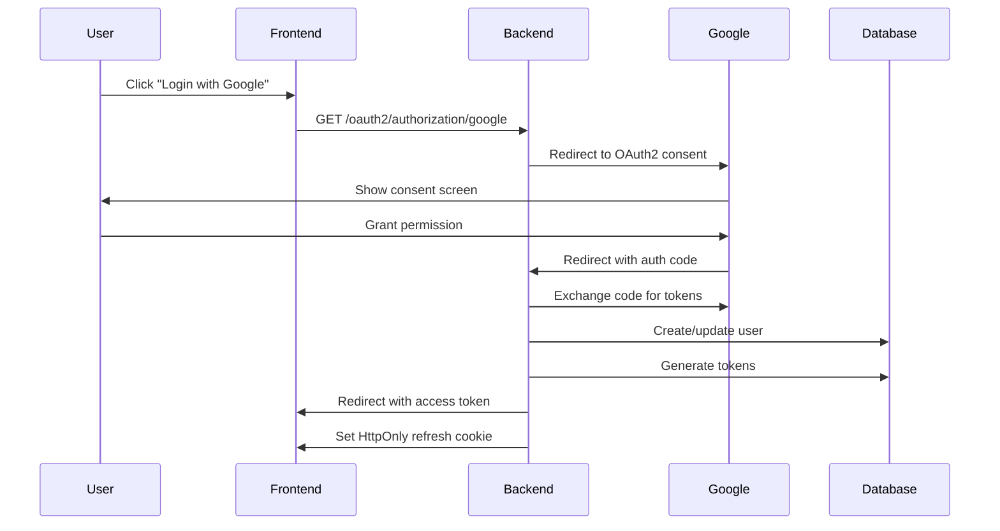
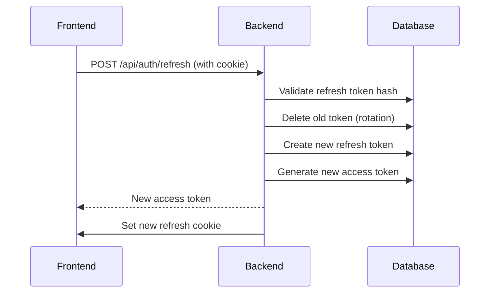
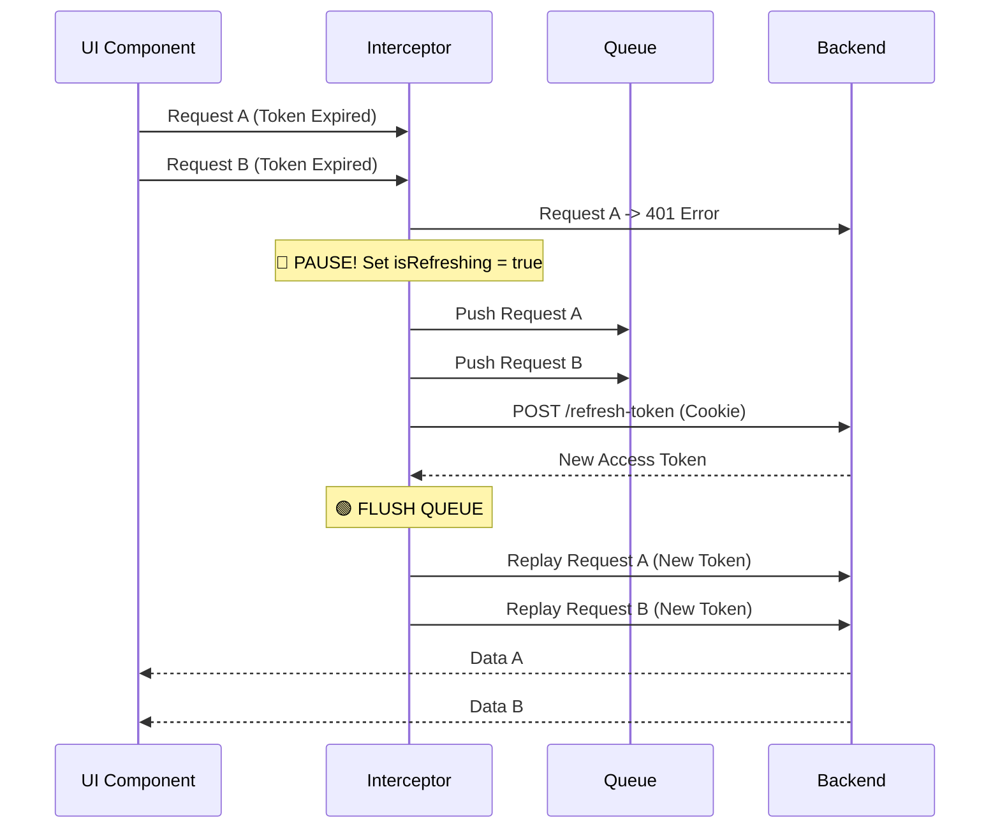

## Authentication & Authorization: The "Invisible" Engineering of Identity

Building an authentication system is deceptive. On the surface, it looks like one of the easiest tasks in backend engineering: accept an email, check a password, and issue a token.

But the difference between a system that "works" and a system that is "secure" lies entirely in the invisible details—the edge cases that rarely happen in development but always happen in production.

This repository, AuthPractice, is a production-grade reference implementation built with Spring Boot and Java. It was built to answer the specific, difficult questions that most tutorials gloss over.

For example, what happens when a user’s shaky internet connection causes them to click "Refresh Session" twice in the exact same millisecond? Without specific transaction isolation, you’ve just created a race condition that corrupts their account. How do you stop a hacker from guessing which emails are valid in your system just by measuring that your server takes 5ms to reject a fake user, but 200ms to reject a real one?

What about the "Zombie Accounts"—the users who sign up but never verify their email? Do they squat on that username forever, or does your system know how to clean them up? And perhaps most critically: if your database is compromised today, can the attacker use the stolen session tokens to impersonate your users, or will they find nothing but useless, hashed data?

This project documents the answers. It ignores the "happy path" to focus on the dirty reality of the internet: network failures, active attacks, and the need for rigorous state management.

---
# part 1: The Backend

##  Architecture Overview

### System Architecture
```
┌─────────────────┐    ┌─────────────────┐    ┌─────────────────┐
│   Frontend SPA  │────│  Spring Boot    │────│   MySQL DB      │
│ (React/Vue/etc) │    │   Backend       │    │                 │
└─────────────────┘    └─────────────────┘    └─────────────────┘
                              │
                              ▼
                       ┌─────────────────┐
                       │   Email Service │
                       │   (Gmail SMTP)  │
                       └─────────────────┘
```

### Backend Layer Structure
```
┌────────────────────────────────────────────────────────────┐
│                     Controllers Layer                      │
│                                                            │
│  ┌──────────────┐  ┌──────────────┐  ┌───────────────┐     │
│  │AuthController│  │UserController│  │AdminController│     │
│  └──────────────┘  └──────────────┘  └───────────────┘     │
│                                                            │
└────────────────────────────────────────────────────────────┘
                              │
                              ▼
┌─────────────────────────────────────────────────────────────┐
│                     Services Layer                          │
│  ┌─────────────┐  ┌─────────────┐  ┌─────────────┐          │
│  │ UserService │  │ OTPService  │  │EmailService │          │
│  │RefreshToken │  │ OAuthService│  │ JwtService  │          │
│  └─────────────┘  └─────────────┘  └─────────────┘          │
└─────────────────────────────────────────────────────────────┘
                              │
                              ▼
┌─────────────────────────────────────────────────────────────┐
│                 Repositories Layer                          │
│  ┌─────────────┐  ┌─────────────┐  ┌─────────────┐          │
│  │   UserRepo  │  │   OTPRepo   │  │RefreshToken │          │
│  └─────────────┘  └─────────────┘  └─────────────┘          │
└─────────────────────────────────────────────────────────────┘
```


##  Authentication Flows

### 1. Local Registration Flow


### 2. OAuth2 Login Flow


### 3. Token Refresh Flow


---

##  Security Features

### Authentication Security
- **JWT Implementation**: Stateless access tokens with short expiration (15 minutes)
- **Refresh Token Rotation**: One-time use tokens with SHA-256 hashing in database
- **Timing Attack Protection**: Dummy password hash comparison to prevent user enumeration
- **Session Management**: Automatic token rotation and secure logout

###  Email Verification Security
- **OTP Rate Limiting**: Maximum 5 OTP requests per hour per email
- **Brute Force Protection**: Maximum 3 failed OTP attempts before blocking
- **OTP Expiration**: Configurable expiry (default 5 minutes)
- **Replay Attack Prevention**: OTPs are deleted after successful use

---

## 🗄️ Database Design

### Schema Overview
```sql
┌─────────────────┐    ┌─────────────────┐    ┌─────────────────┐
│      user       │    │ refresh_tokens  │    │otp_verifications│
├─────────────────┤    ├─────────────────┤    ├─────────────────┤
│ id (UUID)       │    │ id (UUID)       │    │ id (UUID)       │
│ email (unique)  │◄───┤ user_id (FK)    │    │ email           │
│ password (hash) │    │ token_hash      │    │ otp_code        │
│ role (enum)     │    │ expires_at      │    │ attempt_count   │
│ isverified      │    │ created_at      │    │ expires_at      │
│ auth_provider   │    │ last_used_at    │    │ created_at      │
│ oauth_id        │    └─────────────────┘    └─────────────────┘
│ created_at      │                                    │
│ updated_at      │                                    │
└─────────────────┘                                    │
                                                       │
                                                       │
┌─────────────────┐                                    │
│   Indexes       │                                    │
├─────────────────┤                                    │
│ email_UNIQUE    │                                    │
│ idx_oauth_lookup│                                    │
│idx_email_expires│────────────────────────────────────┘
└─────────────────┘
```
---

##  Edge Cases Handled

1. **Abandoned Registration**
   - Users who signup but never verify are automatically cleaned up after 24 hours
   - Prevents "email squatting" and allows retry

2. **Timing Attack Prevention**
   - Always perform password hash comparison, even for non-existent users
   - Uses dummy BCrypt hash to simulate computational work

3. **OAuth User Edge Cases**
   - User tries to login locally with OAuth email → Handled gracefully
   - OAuth user changes password → Revokes all refresh tokens

4. **Concurrent Token Requests**
   - SERIALIZABLE isolation level prevents race conditions
   - Token rotation ensures old tokens become invalid immediately

5. **Expired Token Cleanup**
   - Hourly cleanup job removes expired tokens
   - Prevents database bloat and maintains performance

6. **Rate Limiting**
   - Prevents OTP spam (max 5 per hour)
   - Blocks brute force attempts (max 3 tries)

7. **Expired OTP Handling**
   - Automatic cleanup of expired OTPs
   - Clear error messages for expired vs invalid codes


---

##  Potential Enhancements

###  Security Enhancements
1. **Advanced Session Management**
   - Device management (view active sessions)
   - Remote logout from specific devices
   - Suspicious activity detection

2. **Rate Limiting Improvements**
   - IP-based rate limiting
   - Distributed rate limiting with Redis
   - Adaptive rate limiting based on threat level

###  Monitoring & Analytics
1. **Security Event Logging**
   - Failed login attempt tracking

###  Performance Enhancements
1. **Caching Layer**
   - Redis for frequently accessed user data
   - JWT token blacklisting cache
   - OTP attempt rate limiting cache

###  Feature Enhancements
1. **Additional OAuth Providers**
   - GitHub, Facebook, Microsoft login
   - Enterprise SSO (SAML)
   - Social profile picture import

---
# Part 2: The Frontend 

The frontend is built with **React** and **Vite**. The browser is a hostile environment where state is volatile and scripts can be injected. The frontend's job is to survive this environment.

##  Architecture Overview

The application is built on three core pillars that separate Networking, State, and Routing.

### 1. The Network Layer (The Singleton)
We do not allow individual components to make raw API calls. Instead, a central `AxiosConfig` class acts as the "Traffic Controller."
- **Request Interceptor:** Automatically injects the short-lived Access Token into headers.
- **Response Interceptor:** The "Self-Healing" mechanism. It catches errors, determines if they are due to expiration, and attempts to fix the session before throwing the error to the UI.

### 2. The State Machine (Zustand)
We avoid scattering authentication status across React Contexts. A single global store (`authStore.js`) manages the `isAuthenticated` and `isCheckingAuth` flags. This prevents the "Login Flash"—where a user sees the login screen for a split second before the app realizes they are already logged in.

### 3. The Routing Guard (AuthLayout)
Security logic is lifted out of the pages and into the Router. A Higher-Order Component (HOC) wraps protected routes, acting as a bouncer that checks permissions before the DOM is even mounted.

---

##  The "Silent Refresh" Mechanism

The most complex piece of engineering in this frontend is handling Token Expiration via the **Request Queue**.

**The Problem:**
Imagine a user is on the Dashboard. The dashboard loads and fires 3 simultaneous requests: `GET /profile`, `GET /stats`, and `GET /notifications`.
If the user's token expired 1 second ago, all 3 requests will fail with `401`.
- *Naive Approach:* The app tries to refresh the token 3 times. This causes race conditions on the server and usually logs the user out.
- *Our Approach:* **Request Queuing.**



##  Security Features

### Memory-Only Token Storage
We deliberately **do not** store the Access Token in `localStorage` or `sessionStorage`.
* **The Risk:** `localStorage` is accessible to any JavaScript running on the page (including malicious scripts from 3rd party libraries).
* **The Solution:** The Access Token lives in **React Memory** (inside the Axios Singleton). If the user refreshes the page, the token is lost. That is okay—our application immediately performs a "Silent Refresh" on mount to get a new one using the HttpOnly cookie.

### History Cleaning (OAuth)
When Google redirects back to our app, it sends a one-time code or token in the URL.
* **The Risk:** If the user copies the URL or if analytics scripts read `window.location`, the token leaks.
* **The Solution:** In `OAuthRedirectHandler.js`, we use `Maps(path, { replace: true })`. This destroys the history entry containing the token, so the "Back" button skips the sensitive URL entirely.

---

##  Edge Cases Handled

### 1. The "Infinite Loop" Trap
* **Scenario:** The Refresh Token itself is expired. The app tries to refresh, fails (401), the interceptor catches the failure, tries to refresh again... crashing the browser.
* **Fix:** The interceptor explicitly checks `if (url.includes('/refresh'))`. If the refresh call *itself* fails, we abandon hope and force a logout immediately.

### 2. React Strict Mode Double-Mount
* **Scenario:** In development, React 18 mounts components twice. This caused our OAuth handler to try and process the one-time login token twice, leading to "Invalid Token" errors.
* **Fix:** We implemented a `useRef(false)` guard to ensure the token processing logic runs exactly once per page load, ignoring React's rendering behavior.

### 3. Input Masking (UX Security)
* **Scenario:** A user attempts to type letters into the OTP field.
* **Fix:** The `VerifyOtp.jsx` component implements a regex mask: `value.replace(/\D/g, "")`. It is programmatically impossible for the user to enter non-numeric characters, preventing validation errors before they occur.


##  Setup & Configuration

Create a `.env` file based on `.env.example` and add your credentials

---
This project serves as a comprehensive reference implementation for modern authentication systems. Feel free to use it as a foundation for your own applications or contribute improvements.

---
**Built with ❤️ for developers who want to learn about auth**
